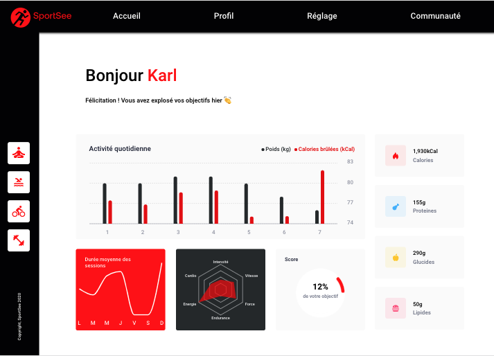

# Projet 12 -- SportSee

## General Information

This project is set up using data fetched from JSON files located inside the public/data folder. For this, you only need the FRONT END.

## Launching the FRONT END project

1. Clone the [repo](https://github.com/MarieRodiet/sportsee_front)
2. cd sportsee
3. npm install
4. npm run start

## Use data from BACK END

You are free to use the data from a local server. In order to do that, you will need to:

1. Install this [repo](https://github.com/OpenClassrooms-Student-Center/P9-front-end-dashboard) and follow the instructions on its README file.
2. Visit this [endpoint](http://localhost:3000/user/12) to check that the server is up and running
3. Go to the sportsee FRONT END repo, find src/pages/App.js and change the variable isMockedUrl to FALSE
4. Refresh the page
